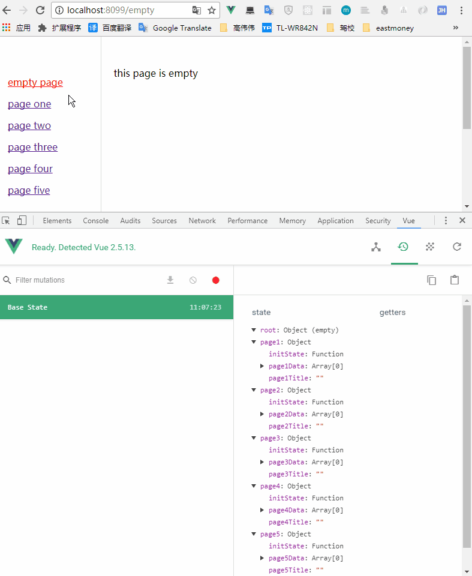

## 重置 vuex 中的状态

### 介绍
大型单页应用，有几十个甚至更多的单页时，随着路由的切换，闲置的 vuex 中的状态将越来越多，这个实例就是在路由切换的时候帮你重置 vuex 中的状态

具体介绍请参考[我的文章](https://github.com/huangshuwei/blog/issues/11)

### 使用

安装
```
npm install
```

运行
```
npm run dev
```

### 效果展示
当切换路由时，将上个路由的状态重置




